# Архитектурный паспорт проекта

## 1. Назначение проекта

Проект — ИИ-ассистент для проверки пакетов с данными.

Ассистент принимает вопрос пользователя о пакете данных, получает результаты автоматических проверок, группирует ошибки и предупреждения, объясняет проблемы простым языком и помогает понять, можно ли передавать пакет дальше в обработку.

Текущий учебный сценарий:

1. Пользователь спрашивает: `Проверь пакет PKG-001. Можно ли его передавать дальше?`
2. Сервис определяет, что в запросе есть `package_id`.
3. LLM выбирает tool `get_validation_report`.
4. Python-обработчик читает результаты проверок из локального JSON-файла.
5. Сервис возвращает результат tool в LLM.
6. LLM формирует финальный структурированный ответ пользователю.

## 2. Контекст и ограничения

Текущий проект — учебный прототип, который работает локально через Ollama.

Ограничения текущего этапа:

- облачные LLM API не используются из-за региональных ограничений;
- основной LLM-провайдер сейчас — локальная Ollama;
- источник данных сейчас — локальный JSON-файл;
- FastAPI, Redis, Postgres, MinIO/S3 и Telegram-бот пока не реализованы, но заложены в архитектуру следующих модулей.

Ожидаемая нагрузка для учебного проекта:

| Параметр | Значение |
|---|---:|
| Нагрузка сейчас | 5–30 RPM |
| Целевая нагрузка MVP | до 100 RPM |
| Ожидаемый TPM сейчас | 10K–30K TPM |
| Целевой TPM для MVP | 50K–170K TPM |
| Средний вход | 200–1000 токенов |
| Средний ответ | 300–700 токенов |
| Бюджет сейчас | $0/день, локальная Ollama |
| Бюджет MVP | до $1–3/день при подключении внешнего провайдера |
| Целевой cache hit rate | 30–40% |
| Целевой timeout LLM-вызова | 30 секунд |

TPM рассчитан приблизительно по формуле: RPM × (средний вход + средний ответ). Для MVP при 100 RPM и 500–1700 токенах на запрос получается 50K–170K TPM.
## 3. Диаграмма компонентов

```mermaid
flowchart LR
    USER["Клиент<br/>CLI сейчас<br/>Telegram / Web позже"]

    GW["<b>API Gateway</b><br/>FastAPI endpoint в Б3.4<br/>auth позже<br/>rate limit позже<br/>request validation"]

    SVC["<b>Service Layer</b><br/>маршрутизация запроса<br/>проверка package_id<br/>Function Calling цикл<br/>tool_calls parser<br/>Bulkhead: семафоры на endpoints позже"]

    CACHE["<b>Cache-Aside</b><br/>Redis позже<br/>TTL: 1 час<br/>key: sha256(model + messages + temperature)<br/>кешируем только temperature=0<br/>cost-critical optimization"]

    LLM["<b>LLM Layer</b><br/>Fallback chain:<br/>Ollama llama3.2 → Ollama qwen2.5 → template response<br/>Circuit Breaker per provider"]

    DATA["<b>Data Layer</b><br/>сейчас: validation_reports.json<br/>позже: Postgres history + metrics<br/>Redis sessions + cache<br/>MinIO/S3 для больших файлов<br/>RAG-хранилище в М5"]

    OLLAMA1["Provider 1<br/>Ollama llama3.2<br/>tool-capable<br/>latency-critical"]

    OLLAMA2["Provider 2<br/>Ollama qwen2.5<br/>fallback для простых ответов<br/>cost-critical"]

    TEMPLATE["Template response<br/>graceful degradation<br/>без LLM"]

    USER -->|"1. запрос"| GW
    GW -->|"2. validation + rate limit"| SVC
    SVC -->|"3. cache lookup"| CACHE

    CACHE -.->|"hit: вернуть готовый ответ"| SVC
    CACHE -.->|"miss"| LLM

    LLM -->|"Circuit Breaker: provider 1"| OLLAMA1
    LLM -->|"Circuit Breaker: provider 2"| OLLAMA2
    LLM -->|"если все LLM недоступны"| TEMPLATE

    SVC -->|"tool handler читает проверки"| DATA
    DATA -->|"результат проверок"| SVC

    OLLAMA1 -->|"tool_call / final answer"| LLM
    OLLAMA2 -->|"fallback answer"| LLM
    TEMPLATE -->|"шаблонный ответ"| LLM

    LLM -->|"ответ LLM"| SVC
    SVC -->|"сохранить cache miss result"| CACHE
    SVC -->|"финальный ответ"| GW
    GW -->|"ответ пользователю"| USER

    style USER fill:#eef2ff,stroke:#6366f1,stroke-width:2px
    style GW fill:#ecfdf5,stroke:#10b981,stroke-width:2px
    style SVC fill:#eef2ff,stroke:#6366f1,stroke-width:2px
    style CACHE fill:#fefce8,stroke:#f59e0b,stroke-width:2px
    style LLM fill:#ecfdf5,stroke:#10b981,stroke-width:2px
    style DATA fill:#fefce8,stroke:#f59e0b,stroke-width:2px
    style OLLAMA1 fill:#fff7ed,stroke:#f97316,stroke-width:2px
    style OLLAMA2 fill:#fff7ed,stroke:#f97316,stroke-width:2px
    style TEMPLATE fill:#fee2e2,stroke:#ef4444,stroke-width:2px
```



## 4. Как читать диаграмму

Архитектура разделена на четыре слоя:

| Слой | Ответственность |
|---|---|
| Gateway | Принять запрос, проверить базовые ограничения, применить rate limit |
| Service | Выполнить бизнес-логику, маршрутизацию, Function Calling цикл |
| LLM | Выбрать модель, выполнить LLM-вызов, переключиться на fallback при сбоях |
| Data | Хранить результаты проверок, историю, кеш и будущую RAG-базу |

Главный принцип: каждый слой можно заменить, не ломая остальные.

Например, если вместо прямого обращения к Ollama позже появится LiteLLM Gateway, изменения должны затронуть в основном LLM-слой, а не бизнес-логику проверки пакетов.

## 5. Поток одного запроса

Пример запроса:

```text
Проверь пакет PKG-001. Можно ли его передавать дальше?
```

Поток обработки:

1. Клиент отправляет запрос.
2. Gateway принимает запрос и передаёт его в Service.
3. Service проверяет, есть ли `package_id` формата `PKG-001`.
4. Service проверяет кеш по ключу `sha256(model + messages + temperature)`.
5. Если в кеше нет ответа, Service отправляет запрос в LLM-слой.
6. LLM выбирает tool `get_validation_report`.
7. Service выполняет Python-обработчик tool.
8. Data Layer возвращает результаты проверок пакета.
9. Service возвращает результат tool обратно в LLM.
10. LLM формирует финальный ответ.
11. Service сохраняет результат в кеш.
12. Gateway возвращает ответ пользователю.

Если пользователь задаёт общий вопрос без `package_id`, tool не вызывается, а ассистент отвечает обычным текстом.

Если пользователь просит проверить пакет, но не указывает `package_id`, Service возвращает просьбу указать идентификатор пакета.

## 6. Архитектурные паттерны

### Request-Response

Основной паттерн взаимодействия для текущей версии проекта.

Пользователь отправляет один запрос и получает один полный структурированный ответ.

Этот паттерн подходит для текущего сценария, потому что ответ обычно короткий: итоговый статус пакета, ошибки, предупреждения и рекомендации.

### Cache-Aside

Перед LLM-слоем планируется Redis-кеш.

Логика:

1. Service сначала ищет ответ в кеше.
2. Если ответ найден, он возвращается без LLM-вызова.
3. Если ответа нет, Service идёт в LLM.
4. После получения ответа Service сохраняет результат в кеш.

Параметры кеша:

- TTL: 1 час;
- ключ: `sha256(model + messages + temperature)`;
- кешируются только детерминированные запросы с `temperature=0`;
- целевой cache hit rate: 30–40%.

### Circuit Breaker

Circuit Breaker ставится на каждый LLM-провайдер отдельно.

Планируемые параметры:

- `fail_max=5`;
- `timeout=60s`;
- ошибки для открытия breaker: timeout, connection error, 5xx.

Если primary-модель недоступна, Circuit Breaker временно перестаёт отправлять к ней запросы, и Service переходит к fallback.

### Fallback chain

Порядок fallback:

1. Primary: `Ollama llama3.2` — основная модель для tool calling.
2. Secondary: `Ollama qwen2.5` — резервная модель для простых ответов без tool calling.
3. Template response — честный шаблонный ответ без LLM, если все модели недоступны.

### Bulkhead

В будущем FastAPI-сервисе будут отдельные лимиты параллельности для разных типов операций:

- проверка одного пакета;
- массовая проверка пакетов;
- справочные вопросы;
- RAG-запросы.

Так всплеск тяжёлых batch-задач не должен блокировать интерактивные запросы пользователя.

## 7. ADR-001: выбор паттерна взаимодействия

**Status:** Accepted  
**Date:** 2026-06-09

### Context

Проект — ИИ-ассистент для проверки пакетов с данными. Основной сценарий: пользователь спрашивает про конкретный пакет, например `PKG-001`, а ассистент возвращает структурированный отчёт: итоговый статус, критичные ошибки, предупреждения и рекомендации.

Ожидаемая нагрузка на учебном этапе — 5–30 RPM, в MVP — до 100 RPM. Средний вход — 200–1000 токенов, средний ответ — 300–700 токенов. Ответ должен быть понятным и достаточно быстрым, но не требует генерации в реальном времени по токенам.

### Decision

Выбран паттерн **Request-Response**.

Пользователь отправляет один запрос и получает один полный ответ после выполнения всех шагов: маршрутизация, возможный tool call, чтение данных, анализ результата и финальная генерация ответа.

Этот паттерн выбран, потому что текущий сценарий короткий, интерактивный и не требует долгой фоновой обработки.

### Consequences

Плюсы: простая реализация и отладка; удобно тестировать через CLI и будущий FastAPI endpoint; подходит для коротких структурированных ответов; проще логировать полный жизненный цикл одного запроса.

Минусы: пользователь ждёт весь ответ целиком; при долгих LLM-вызовах может расти latency; для batch-проверок многих пакетов Request-Response может стать неудобным.

### Alternatives considered

**Streaming** отвергнут на текущем этапе, потому что ответы короткие и структурированные. Пользователю важнее получить цельный отчёт, чем видеть постепенную генерацию.

**Queue-based** отвергнут для текущего сценария, потому что проверка одного пакета выполняется быстро. Очередь станет полезной позже для массовой проверки пакетов.

**Fan-out / Fan-in** пока не нужен, потому что один запрос обрабатывается одним основным LLM-циклом и одним tool `get_validation_report`.

## 8. ADR-002: стратегия fault tolerance

**Status:** Accepted  
**Date:** 2026-06-09

### Context

LLM-вызовы могут быть медленными, нестабильными и недоступными. В текущем проекте облачные API не используются из-за региональных ограничений, поэтому основной провайдер — локальная Ollama.

При этом архитектура должна быть готова к будущему подключению нескольких провайдеров и централизованному управлению fallback.

### Decision

Выбрана стратегия:

- primary provider: `Ollama llama3.2`;
- fallback provider: `Ollama qwen2.5` для простых ответов без tool calling;
- final fallback: template response без LLM;
- Circuit Breaker — отдельно на каждого LLM-провайдера;
- Cache-Aside перед LLM-слоем;
- Bulkhead в Service-слое для ограничения параллельных тяжёлых операций.

Планируемые параметры Circuit Breaker:

- `fail_max=5`;
- `timeout=60s`;
- ошибки для открытия breaker: timeout, connection error, 5xx.

Параметры кеша:

- Redis;
- TTL: 1 час;
- ключ: `sha256(model + messages + temperature)`;
- кешируются только детерминированные запросы с `temperature=0`.

### Consequences

Плюсы:

- сбой одной модели не останавливает весь сервис;
- повторяющиеся запросы могут обслуживаться из кеша;
- при полном отказе LLM пользователь получает понятный шаблонный ответ, а не техническую ошибку;
- архитектура готова к подключению LiteLLM Gateway.

Минусы:

- появляется дополнительная логика маршрутизации;
- нужно следить за состоянием Circuit Breaker по каждому провайдеру;
- кеш требует аккуратного выбора ключа и TTL;
- fallback-модель может отвечать хуже primary-модели.

### Alternatives considered

**Один LLM-провайдер без fallback** отвергнут, потому что отказ модели полностью ломает пользовательский сценарий.

**Один общий Circuit Breaker на весь LLM-слой** отвергнут, потому что сбой одного провайдера не должен блокировать остальные.

**Только template response без fallback-модели** оставлен как последний уровень деградации, но не как основной fallback.

## 9. Потенциальные точки отказа

| Слой | Что может отказать | Что произойдёт | Паттерн смягчения | Graceful degradation |
|---|---|---|---|---|
| Gateway | FastAPI endpoint, auth, rate limit | Пользователь не сможет отправить запрос или получит отказ | Rate limiting, healthcheck, timeout | Вернуть понятный `503 Service unavailable` или `429 Too many requests` |
| Service | Ошибка маршрутизации, ошибка парсинга tool_calls, ошибка валидации package_id | Запрос не сможет пройти полный цикл обработки | Request validation, structured logging, fallback branch | Вернуть понятное сообщение: указать корректный `package_id` |
| LLM | Ollama недоступна, модель не поддерживает tools, timeout генерации | Ассистент не сможет сформировать финальный LLM-ответ | Circuit Breaker, Fallback chain, Cache-Aside | Переключиться на fallback-модель, кеш или template response |
| Data | JSON-файл отсутствует, Redis/Postgres недоступны, RAG-хранилище недоступно | Нельзя получить результаты проверок пакета | Repository abstraction, retries для чтения, fallback message | Сообщить, что данные по пакету временно недоступны |
| Cache | Redis недоступен | Все запросы идут напрямую в LLM | Cache-Aside | Работать без кеша, но с большей задержкой и стоимостью |
| LiteLLM Gateway | Proxy недоступен или неверная конфигурация | Service не может обратиться к LLM через gateway | Healthcheck, fallback на прямой Ollama client | Временно использовать прямой клиент Ollama |

## 10. Latency-critical и cost-critical вызовы

В проекте есть два типа LLM-вызовов.

### Latency-critical

Запросы, где пользователь ждёт интерактивный ответ:

- проверка одного пакета;
- объяснение результата проверки;
- уточняющий вопрос пользователя.

Для них важны:

- быстрый timeout;
- fallback при сбое primary-модели;
- кеширование повторяющихся запросов;
- короткие ответы.

### Cost-critical

Запросы, где важнее экономия ресурсов:

- повторные объяснения одинаковых статусов;
- batch-анализ многих пакетов;
- будущие RAG-запросы по документации.

Для них важны:

- Cache-Aside;
- batch-обработка;
- дешёвая fallback-модель;
- ограничение максимального размера ответа.

## 11. LiteLLM Gateway

LiteLLM рассматривается как готовый LLM Gateway между Service-слоем и LLM-провайдерами.

Потенциальная схема после внедрения:

```text
Service Layer → LiteLLM Gateway → Ollama / Cloud LLM providers
```

Что может дать LiteLLM:

- единый OpenAI-compatible endpoint;
- маршрутизация между моделями;
- fallback chains;
- централизованные retries;
- единая точка для будущего логирования и контроля стоимости.

Для текущего учебного проекта LiteLLM пока не внедряется в основной код, потому что агент уже работает напрямую с локальной Ollama. Но конфигурация подготовлена в файле:

```text
docs/litellm/config.yaml
```

Решение на текущий этап:

**LiteLLM изучаем и документируем, но в runtime проекта пока не подключаем.**

Причины:

- текущий проект использует локальную Ollama;
- основной сценарий уже работает через OpenAI-compatible endpoint Ollama;
- пока нет реальной необходимости в балансировке между облачными провайдерами;
- в следующих модулях LiteLLM можно подключить как отдельный Gateway без переписывания Service-слоя.

Пример локального запуска LiteLLM proxy:

```powershell
python -m pip install "litellm[proxy]"
litellm --config docs/litellm/config.yaml --port 4000
```

Пример запроса через OpenAI-compatible endpoint LiteLLM:

```powershell
curl http://localhost:4000/v1/chat/completions `
  -H "Authorization: Bearer sk-local-dev-key" `
  -H "Content-Type: application/json" `
  -d "{\"model\":\"data-package-assistant-primary\",\"messages\":[{\"role\":\"user\",\"content\":\"Что означает статус BLOCKED?\"}]}"
```

