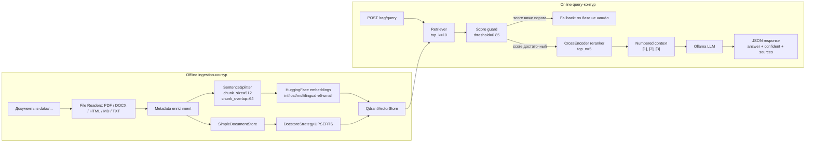
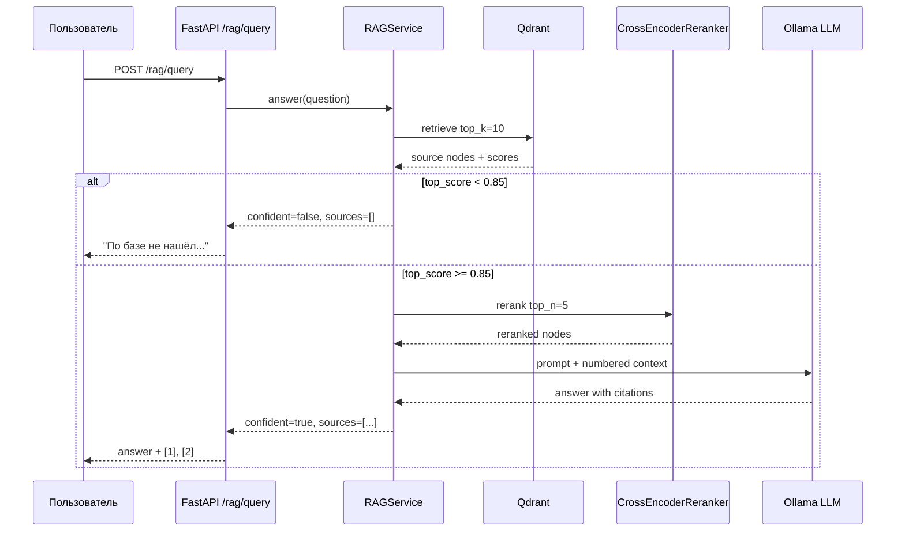

# Блок 5.3. Архитектура RAG с LlamaIndex

## Зависимости

| Пакет | Назначение |
|-------|------------|
| llama-index | Основной фреймворк RAG |
| llama-index-vector-stores-qdrant | Интеграция LlamaIndex с Qdrant |
| llama-index-readers-file | Чтение PDF, DOCX и других форматов |
| llama-index-embeddings-huggingface | Поддержка локальных эмбеддингов HuggingFace |
| llama-index-llms-ollama | Интеграция LlamaIndex с Ollama |

---

## Решение по коллекциям

В блоке 5.2 коллекция `documents` наполнялась напрямую через `qdrant-client` и использовала собственный формат payload.

Для блока 5.3 была создана отдельная коллекция:

```text
rag_block_03
```

Причина:

- LlamaIndex хранит документы в собственном формате (`_node_content`);
- подключение к коллекции из блока 5.2 привело бы к неполным `source_nodes`;
- отдельная коллекция позволила использовать полный функционал LlamaIndex без изменения уже реализованного bare-metal решения.

Для реализации bare-metal была создана отдельная коллекция:

```text
rag_baremetal_block_03
```

Это позволило независимо сравнить две реализации одного и того же RAG-пайплайна.

---

## Реализованные компоненты

В рамках задания были реализованы две независимые реализации RAG:

- `app/services/rag.py` — реализация на базе LlamaIndex;
- `app/services/rag_baremetal.py` — реализация без использования фреймворка.

### RAGService (LlamaIndex)

Класс `RAGService` реализует полный цикл работы с RAG.

Основные методы:

- `build()` — подключение к существующей коллекции Qdrant и создание `QueryEngine`;
- `answer(question)` — выполнение поиска, генерация ответа LLM и формирование результата;
- `close()` — завершение работы сервиса.

Метод `answer()` возвращает результат в следующем формате:

```python
{
    "answer": str,
    "top_score": float,
    "sources": [
        {
            "text": str,
            "source": str | None,
            "score": float,
        }
    ]
}
```

При выполнении поиска используются следующие настройки:

- `similarity_top_k = 3`;
- возврат трёх наиболее релевантных документов;
- сохранение текста найденного чанка;
- сохранение имени исходного документа;
- возврат значения similarity score для каждого источника.

---

## Сравнение LlamaIndex и Bare-metal

| Критерий | LlamaIndex | Bare-metal |
|----------|------------|------------|
| Строк кода (ingestion + query, без импортов) | Меньше. Основной pipeline инкапсулирован во фреймворке. | Больше. Все этапы реализованы вручную. |
| Поддержка форматов из коробки | Есть (`SimpleDirectoryReader`, `llama-index-readers-file`). | Нет. Необходимо самостоятельно реализовывать чтение каждого формата. |
| Что дописать для PDF / DOCX | Установить `llama-index-readers-file` и использовать соответствующий Reader. | Реализовать чтение PDF/DOCX вручную или подключить отдельные библиотеки. |
| Что дописать для batch-ingestion / async | Поддерживается библиотекой, требуется минимальная настройка. | Необходимо самостоятельно реализовать пакетную обработку и асинхронную загрузку. |
| Где удобнее отлаживать `top_score` / `source_nodes` | `response.source_nodes` уже содержит текст, источник и score. | Полный контроль над результатами `query_points()`, но требуется самостоятельно формировать ответ. |
| Где гибче подменять компоненты (re-ranker, chunker) | Есть готовые компоненты LlamaIndex, которые можно заменить через настройки. | Максимальная гибкость: любой этап можно заменить собственной реализацией. |

### Вывод

В ходе работы были реализованы две версии одного и того же RAG-пайплайна: на LlamaIndex и без использования фреймворка.

LlamaIndex позволяет значительно сократить объём кода и быстрее собрать рабочий RAG благодаря готовым компонентам для индексации, поиска и генерации ответа.

Bare-metal реализация требует большего количества кода, но обеспечивает полный контроль над каждым этапом обработки: чтением документов, разбиением на чанки, поиском в Qdrant и формированием промпта.

Для дипломного проекта в качестве основной реализации выбрана bare-metal версия, поскольку она предоставляет больше возможностей для настройки и лучше демонстрирует понимание архитектуры RAG. LlamaIndex использовался как эталонная реализация для сравнения и изучения готового фреймворка.

---

## Интеграция с FastAPI

Для работы с RAG реализован отдельный endpoint:

```http
POST /rag/query
```

Тело запроса:

```json
{
  "question": "Какие обязательные технические поля должны быть в meta-файле?"
}
```

Ответ:

```json
{
  "answer": "ctl_action и ctl_validfrom.",
  "top_score": 0.905,
  "sources": [
    {
      "text": "...",
      "source": "meta_required_tech_fields.md",
      "score": 0.905
    }
  ]
}
```

Для обмена данными были реализованы отдельные Pydantic-схемы:

- `RAGQueryRequest`;
- `RAGQueryResponse`;
- `RAGSource`.

Это позволило выделить RAG в самостоятельный API и не изменять существующий endpoint `/chat`.

---

## Инициализация RAG

После первоначальной реализации было принято решение отказаться от создания `RAGService` непосредственно в роутере.

В итоговой реализации сервис создаётся один раз во время запуска приложения через механизм `lifespan` FastAPI и сохраняется в `app.state`.

Это позволяет:

- избежать повторной инициализации при каждом запросе;
- использовать один экземпляр сервиса для всех пользователей;
- корректно освобождать ресурсы при завершении работы приложения.

Схема работы:

```text
Application startup
        │
        ▼
lifespan
        │
        ▼
RAGService.build()
        │
        ▼
app.state.rag_service
        │
        ▼
POST /rag/query
        │
        ▼
request.app.state.rag_service
        │
        ▼
answer()
```

При завершении приложения вызывается `rag_service.close()`, после чего закрываются остальные ресурсы приложения (`OpenAI`, `HTTPClient`, `Redis`).

---

## Прогон 5 тестовых вопросов

| № | Вопрос | Top score | Результат | Оценка |
|---|---------|:--------:|-----------|---------|
| 1 | Какие обязательные технические поля должны быть в meta-файле? | **0.905** | Ответ: `ctl_action` и `ctl_validfrom`. Источник: `meta_required_tech_fields.md`. | ✅ Корректный ответ. |
| 2 | Что проверяет правило `META_FIELDS_EXIST_IN_DATA`? | **0.914** | Ответ: проверка наличия в data-файле всех полей, описанных в meta-файле. Источник: `meta_fields_exist_in_data.md`. | ✅ Корректный ответ. |
| 3 | Что означает проверка `DATA_FIELDS_EXIST_IN_META`? | **0.905** | Ответ: проверка соответствия полей data-файла описанию в meta-файле. Источники: `data_fields_exist_in_meta.md`, `meta_fields_exist_in_data.md`. | ✅ Корректный ответ. |
| 4 | Какие проверки выполняются для соответствия meta-файла и data-файла? | **0.896** | Модель объединила информацию из нескольких документов (`meta_fields_exist_in_data.md`, `data_fields_exist_in_meta.md`, `meta_file_format.md`). | ✅ Проверен синтез информации из нескольких источников. |
| 5 | Какие требования предъявляются к XML-схеме пакета данных? | **0.834** | В базе знаний отсутствует информация про XML-схему. Модель попыталась сформировать ответ по наиболее похожим документам (`file_naming.md`, `meta_file_structure.md`), поэтому результат нельзя считать корректным. | ⚠️ Показано ограничение текущей реализации RAG. |

---

## Итоги

В рамках задания была реализована полноценная архитектура RAG двумя способами:

- с использованием фреймворка **LlamaIndex**;
- в виде собственной **bare-metal** реализации.

LlamaIndex позволил быстро собрать рабочий pipeline поиска и генерации ответа за счёт готовых компонентов для индексации документов, поиска релевантного контекста и взаимодействия с LLM.

Bare-metal реализация потребовала большего количества кода, однако обеспечила полный контроль над всеми этапами обработки данных и лучше подходит для дальнейшего развития дипломного проекта.

RAG был интегрирован в существующее FastAPI-приложение через отдельный endpoint `/rag/query`. Инициализация сервиса выполняется один раз при запуске приложения через механизм `lifespan`, что соответствует рекомендуемой архитектуре FastAPI и исключает повторное построение индекса при каждом запросе.

Проведённое тестирование показало, что система корректно отвечает на вопросы, информация о которых присутствует в базе знаний, и способна использовать несколько документов при формировании ответа.

При запросе, ответ на который отсутствует в базе знаний, модель попыталась сформировать ответ по наиболее похожим документам вместо корректного отказа. Это показывает необходимость дальнейшего развития RAG за счёт использования порога релевантности (`top_score`) и реализации механизма fallback, позволяющего сообщать пользователю об отсутствии достаточного контекста для формирования ответа.
---

# Блок 5.5. Корпоративный RAG-ассистент

## Актуальное состояние после блока 5.5

В блоке 5.5 RAG был расширен до корпоративного сценария:

- добавлен multi-format ingestion для PDF, DOCX, HTML, Markdown и TXT;
- добавлено metadata-обогащение документов;
- ingestion вынесен в отдельный offline-контур;
- используется `IngestionPipeline` с `SimpleDocumentStore` и `DocstoreStrategy.UPSERTS`;
- query pipeline разделён на retrieval, score guard, reranking и генерацию ответа;
- `/rag/query` возвращает цитаты, источники и флаг `confident`;
- добавлен endpoint `/documents/upload` для загрузки документов с фоновой индексацией.

Историческая часть выше описывает реализацию блока 5.3. Актуальная рабочая реализация после блока 5.5 находится в:

- `app/services/ingestion.py`;
- `app/services/ingestion_pipeline.py`;
- `scripts/ingest.py`;
- `app/services/rag.py`;
- `app/routers/documents.py`;
- `app/routers/rag.py`.

---

## Архитектура: два независимых контура

Корпоративный RAG разделён на два контура:

1. **Offline ingestion-контур** — читает документы, обогащает metadata, разбивает на чанки, считает embeddings и записывает их в Qdrant.
2. **Online query-контур** — принимает вопрос пользователя, ищет релевантные чанки, применяет score guard, reranker и формирует ответ с цитатами.

Такое разделение важно, потому что индексация может быть долгой и тяжёлой, а пользовательский запрос должен выполняться быстро.



---

## Корпус документов

Для блока 5.5 подготовлен учебный корпоративный корпус по предметной области дипломного проекта: проверка пакетов данных, meta-файлов, data-файлов, статусов, ошибок и рекомендаций.

Корпус расположен в папке:

```text
data/
```

Основная структура:

```text
data/
  data_file_requirements/
  metadata_requirements/
  package_processing/
  support_cases/
  validation_rules/
  rag-block-03/
```

Инвентаризация корпуса зафиксирована в отдельном файле:

```text
docs/data_inventory.md
```

На момент формирования инвентаризации:

```text
Количество файлов: 70
Общий размер: 481.08 КБ
```

Поддерживаемые форматы:

- `.md`;
- `.txt`;
- `.html`;
- `.docx`;
- `.pdf`.

Для подготовки учебного корпуса создан скрипт:

```text
scripts/download_data.py
```

---

## Multi-format ingestion

Чтение документов реализовано в:

```text
app/services/ingestion.py
```

Поддерживаемые reader-стратегии:

| Формат | Reader / способ чтения |
|--------|------------------------|
| PDF | `PyMuPDFReader` |
| DOCX | `DocxReader` |
| HTML | `HTMLTagReader` |
| Markdown | `MarkdownReader` |
| TXT | обычное чтение текстового файла |

Функция `load_documents_from_directory()` возвращает:

```python
documents, failed_files
```

где:

- `documents` — список документов LlamaIndex;
- `failed_files` — список файлов, которые не удалось прочитать.

Файлы с ошибками не попадают в индекс. В `app/services/ingestion_pipeline.py` для таких файлов предусмотрено переименование в `.failed`.

---

## Metadata enrichment

Для каждого документа добавляются metadata:

| Поле | Назначение |
|------|------------|
| `source` | имя исходного файла |
| `file_name` | имя файла |
| `file_path` | путь к файлу |
| `extension` | расширение файла |
| `file_size_bytes` | размер файла |
| `created_at` | дата создания из `stat` |
| `last_modified` | дата последнего изменения из `stat` |
| `author` | автор из DOCX core properties, если доступен |
| `category` | категория из пути `data/<category>/file` |
| `version` | версия из имени файла, если есть |
| `document_id` | стабильный идентификатор документа |

Пример `document_id`:

```text
data\rag-block-03\data_fields_exist_in_meta.md::part-0
```

Стабильный `document_id` нужен для инкрементальной индексации: повторный запуск ingestion должен понимать, что документ уже был обработан.

Технические metadata исключаются из embeddings через:

```python
excluded_embed_metadata_keys
```

Это сделано для того, чтобы embedding строился в основном по смысловому содержанию документа, а не по шумным техническим полям вроде пути, размера файла или даты изменения.

---

## IngestionPipeline и UPSERTS

Основной ingestion запускается командой:

```bash
python scripts/ingest.py data
```

Также ingestion доступен как функция:

```python
run_ingestion_pipeline(data_dir)
```

в файле:

```text
app/services/ingestion_pipeline.py
```

Используемые компоненты:

| Компонент | Значение |
|----------|----------|
| `IngestionPipeline` | основной pipeline индексации |
| `SimpleDocumentStore` | хранение состояния документов |
| `DocstoreStrategy.UPSERTS` | обновление только изменённых документов |
| `SentenceSplitter` | разбиение на чанки |
| `HuggingFaceEmbedding` | построение embeddings |
| `QdrantVectorStore` | запись в Qdrant |

Проверка повторного запуска:

```text
Первый запуск:
10 changed, 133 unchanged, 0 deleted
Создано или обновлено чанков: 20

Повторный запуск:
0 changed, 143 unchanged, 0 deleted
Создано или обновлено чанков: 0
```

Это подтверждает, что повторный ingest не дублирует чанки.

---

## Параметры чанкинга

Используются параметры, выбранные по итогам экспериментов блока 5.4:

```env
RAG_CHUNK_SIZE=512
RAG_CHUNK_OVERLAP=64
RAG_SIMILARITY_TOP_K=10
```

В ingestion используется:

```python
SentenceSplitter(
    chunk_size=512,
    chunk_overlap=64,
)
```

Такая конфигурация выбрана как базовая для корпоративного RAG, потому что в экспериментах блока 5.4 она дала стабильные значения retrieval-метрик без лишнего увеличения числа чанков.

---

## Reranker

В query pipeline подключён reranker из блока 5.4:

```text
BAAI/bge-reranker-v2-m3
```

Режим работы:

```env
RAG_RERANKER_ENABLED=true
RAG_RERANKER_TOP_N=5
```

Логика:

```text
retrieval top_k=10
        ↓
reranker
        ↓
top_n=5 наиболее релевантных источников
```

Reranker используется после векторного поиска и до формирования numbered context. Это позволяет сначала быстро достать кандидатов из Qdrant, а затем точнее переупорядочить найденные фрагменты.

---

## Query pipeline

Актуальная реализация находится в:

```text
app/services/rag.py
```

Pipeline запроса:

```text
question
  ↓
retriever.retrieve(question), top_k=10
  ↓
score guard по top_score
  ↓
если score ниже threshold → fallback без вызова LLM
  ↓
если score достаточный → reranker top_n=5
  ↓
нумерованный контекст [1], [2], [3]
  ↓
Ollama LLM
  ↓
ответ с citations и JSON sources
```

Схема:



---

## Score guard и честный отказ

Для защиты от галлюцинаций используется настройка:

```env
RAG_SCORE_THRESHOLD=0.85
```

Изначально рассматривался порог `0.3`, но он слишком низкий для текущей embedding-модели `intfloat/multilingual-e5-small`.

Проверка на вопросе вне базы:

```text
Вопрос:
Какая погода завтра в Париже и какой курс евро?

Результат:
top_score = 0.797
threshold = 0.850
confident = false
sources = []
```

Ответ:

```text
По базе не нашёл, могу эскалировать вопрос специалисту.
```

Проверка на вопросе по базе:

```text
Вопрос:
Какие обязательные технические поля должны быть в meta-файле?

Результат:
top_score = 0.927
confident = true
sources = есть
```

Таким образом, threshold `0.85` выбран эмпирически для текущего корпуса и текущей embedding-модели:

- релевантный вопрос по базе проходит порог;
- нерелевантный вопрос про погоду и курс валюты не проходит порог;
- LLM не вызывается при недостаточном score.

Дополнительно в prompt задано правило отвечать только по контексту. Это даёт двухслойную защиту:

1. кодовый score guard до вызова LLM;
2. prompt rule на случай, если поиск всё же вернул похожий контекст.

---

## Формат ответа `/rag/query`

Endpoint:

```http
POST /rag/query
```

Тело запроса:

```json
{
  "question": "Какие обязательные технические поля должны быть в meta-файле?"
}
```

Формат ответа:

```json
{
  "answer": "Ответ с цитатами [1], [2]",
  "top_score": 0.927,
  "confident": true,
  "sources": [
    {
      "id": "1",
      "file_name": "meta_required_tech_fields.md",
      "page": null,
      "score": 0.915,
      "snippet": "Наличие обязательных технических полей..."
    }
  ]
}
```

Если релевантной информации нет:

```json
{
  "answer": "По базе не нашёл, могу эскалировать вопрос специалисту.",
  "top_score": 0.797,
  "confident": false,
  "sources": []
}
```

---

## Upload endpoint

Для загрузки новых документов реализован endpoint:

```http
POST /documents/upload
```

Файл:

```text
app/routers/documents.py
```

Endpoint принимает файл через `UploadFile`, сохраняет его в `data/<category>/...` и запускает ingestion через `BackgroundTasks`.

Пример запроса:

```bash
curl.exe -i -X POST "http://127.0.0.1:8000/documents/upload?category=uploads" \
  -F "file=@data\validation_rules\validation_rules_05_v1.2.pdf"
```

Пример ответа:

```http
HTTP/1.1 202 Accepted
```

```json
{
  "status": "accepted",
  "message": "Файл сохранён. Индексация запущена в фоне.",
  "file_name": "validation_rules_05_v1.2_1.pdf",
  "category": "uploads",
  "path": "data\\uploads\\validation_rules_05_v1.2_1.pdf"
}
```

Проверка фоновой индексации:

```text
Background ingestion completed:
{
  'documents': 145,
  'nodes': 1,
  'failed_files': [],
  'manifest': {
    'changed': 1,
    'unchanged': 144,
    'deleted': 0
  },
  'collection': 'rag_block_03'
}
```

---

## Проверенные сценарии

### 1. Повторный ingest не дублирует чанки

```bash
python scripts/ingest.py data
python scripts/ingest.py data
```

Результат второго запуска:

```text
0 changed, 143 unchanged, 0 deleted
Создано или обновлено чанков: 0
```

### 2. `/rag/query` отвечает по базе

Вопрос:

```text
Какие обязательные технические поля должны быть в meta-файле?
```

Результат:

```text
top_score = 0.927
confident = true
sources = есть
citations = [1], [2], [3]
```

### 3. `/rag/query` честно отказывается вне базы

Вопрос:

```text
Какая погода завтра в Париже и какой курс евро?
```

Результат:

```json
{
  "answer": "По базе не нашёл, могу эскалировать вопрос специалисту.",
  "top_score": 0.797,
  "confident": false,
  "sources": []
}
```

### 4. `/documents/upload` сохраняет PDF и запускает ingestion

Результат:

```text
HTTP/1.1 202 Accepted
Background ingestion completed
failed_files = []
```

---


## Реализация multi-turn, SSE, Telegram и Docker Compose

После первичной реализации корпоративного RAG были дополнительно закрыты интеграционные требования блока 5.5.

### Multi-turn через существующую историю чата

Multi-turn реализован через существующий chat-контур:

```text
POST /chats/{chat_id}/messages
```

История сообщений уже хранится в текущем chat repository:

- в локальном режиме — через JSON-хранилище;
- в Docker/production-режиме — через Postgres.

Второй store для истории диалога не создавался.

Для коротких follow-up вопросов добавлен rewrite поискового запроса. Если пользователь пишет вопрос вроде:

```text
А для них какая критичность?
```

сервис берёт предыдущий самостоятельный вопрос пользователя и формирует поисковую строку вида:

```text
Какие обязательные технические поля должны быть в meta-файле?
Уточнение пользователя: А для них какая критичность?
```

Это нужно не для генерации ответа, а для retrieval: векторный поиск получает больше контекста и может найти релевантный документ.

Проверенный сценарий:

```text
1. Какие обязательные технические поля должны быть в meta-файле?
2. А для них какая критичность?
```

Результат follow-up:

```text
top_score = 0.92
confident = true
sources = есть
```

В найденных источниках присутствует:

```text
Критичность: ERROR
```

---

### SSE на `/chats/{chat_id}/messages`

Endpoint:

```http
POST /chats/{chat_id}/messages
```

возвращает `StreamingResponse` с SSE-событиями.

Формат token-события:

```text
data: {"type": "token", "delta": "..."}
```

Формат финального события с источниками:

```text
event: sources
data: {"type": "sources", "message_id": "...", "top_score": 0.92, "confident": true, "sources": [...]}
```

Формат завершения:

```text
data: {"type": "done", "message_id": "..."}
```

Для корректной передачи переносов строк используется JSON-сериализация:

```python
json.dumps(event, ensure_ascii=False)
```

Это защищает SSE-поток от разрыва события из-за `\n` внутри текста ответа.

---

### Telegram-интеграция через RAG

Telegram-бот использует тот же backend endpoint:

```text
POST /chats/{chat_id}/messages
```

Поток работы:

```text
Пользователь пишет в Telegram
  ↓
bot получает или создаёт chat_id
  ↓
bot вызывает /chats/{chat_id}/messages
  ↓
backend отдаёт SSE token events
  ↓
bot постепенно редактирует сообщение через edit_text
  ↓
bot получает sources event
  ↓
bot добавляет источники в финальный ответ
  ↓
bot показывает inline-кнопки feedback
```

Debounce реализован в `bot/web.py`:

```text
EDIT_UPDATE_INTERVAL_SECONDS = 0.8
```

То есть Telegram-сообщение редактируется не чаще одного раза примерно в 800 мс. Это защищает от flood control и соответствует требованию throttling/debounce 700–1000 мс.

Feedback реализован через существующие inline-кнопки:

```text
👍 / 👎
```

Кнопки вызывают backend endpoint:

```http
POST /chats/{chat_id}/messages/{message_id}/feedback
```

---

### Docker Compose

Стек поднимается одной командой:

```bash
docker compose up -d
```

В compose-стеке есть сервисы:

```text
app
bot
qdrant
redis
postgres
migrate
ingest
phoenix
```

Одноразовые сервисы:

```text
migrate
ingest
```

`migrate` выполняет миграции БД:

```text
alembic upgrade head
```

`ingest` ждёт готовности Qdrant и запускает индексацию:

```text
python scripts/wait_for_qdrant.py && python scripts/ingest.py data
```

После успешного запуска:

```text
ingest   Exited (0)
migrate  Exited (0)
app      Up (healthy)
bot      Up
qdrant   Up
redis    Up (healthy)
postgres Up (healthy)
```

Для `app` увеличен `healthcheck.start_period`, потому что при старте приложение загружает embedding-модель и reranker.

---

## Оставшиеся ограничения

На текущем этапе реализованы основные требования блока 5.5.

Ограничения, которые можно развивать дальше:

- гибридный поиск в Qdrant;
- калибровка `RAG_SCORE_THRESHOLD` на расширенном golden dataset;
- контроль доступа к документам на этапе retrieval;
- отдельная таблица логов RAG-запросов для анализа пробелов в базе знаний;
- более точный streaming напрямую из LLM вместо имитации потоковой выдачи готового RAG-ответа;
- сохранение sources в отдельную нормализованную таблицу вместо `media_refs`;
- production-настройки для кеширования HuggingFace-моделей внутри Docker.

---

## Итог блока 5.5

В блоке 5.5 минимальный RAG из блока 5.3 был расширен до корпоративного RAG-ассистента.

Главный результат:

```text
документы разных форматов
  → metadata enrichment
  → IngestionPipeline + UPSERTS
  → Qdrant
  → retrieval top_k=10
  → score guard
  → reranker top_n=5
  → ответ с citations и sources
```

Система умеет:

- индексировать 50+ документов разных форматов;
- повторно запускать ingestion без дублей;
- принимать новые документы через API;
- отвечать на вопросы по базе знаний;
- честно отказываться, если ответа в базе нет;
- возвращать структурированные источники для проверки ответа пользователем.